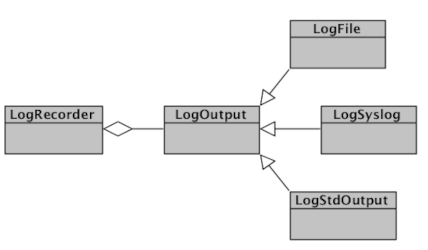
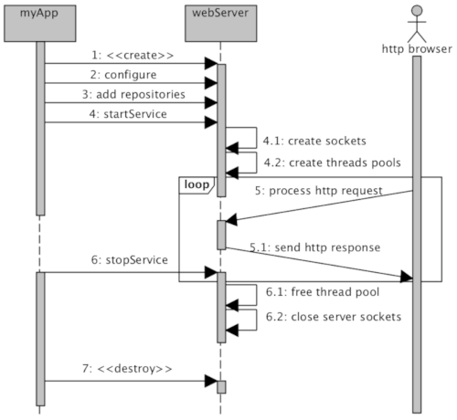
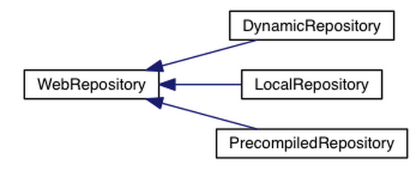
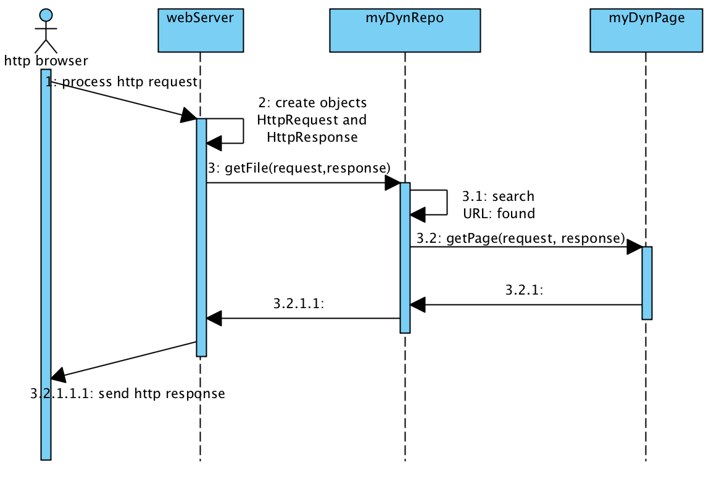
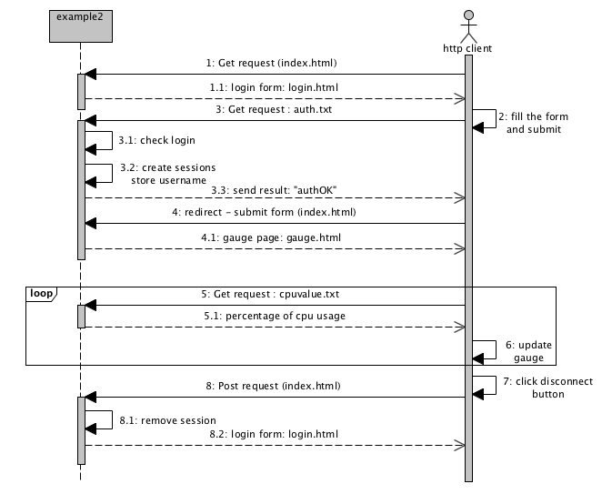

# libnavajo : Web Interfaces and REST APIs for C++ Projects #

### **Brief Description:**

**Modern C++ implementation of an HTTP/1.x and HTTP/2 server**

* **High-performance, multi-threaded HTTP server**: Efficient handling of requests with FIFO connection queue and thread pooling for optimal concurrency.  
* **Simple and intuitive API**: Method-based structure that focuses on handling specific HTTP requests, making it easy to learn and integrate.  
* **Built-in session management**: Automatically handles user sessions, simplifying state management for web applications.  
* **Modular and reusable design**: Components can be reused across different parts of an application, promoting clean organization and maintainable code.  
* **Type-safe headers and MIME type support**: Ensures robust and secure handling of HTTP headers and content types.

**Advanced Security and Protocol Support**:

* **Full SSL/TLS support**: Provides secure connections via HTTPS.  
* **Client certificate authentication**: Supports mutual TLS (mTLS) for enhanced security.  
* **PAM (Pluggable Authentication Module) integration**: Enables server-side authentication using system accounts.  
* **HTTP authentication**: Built-in support for basic authentication mechanisms.

**Feature-Rich Functionality**:

* **WebSocket support (RFC 6455\)**: Full-duplex communication over WebSocket protocol, with or without TLS (`wss://`).  
* **Multipart form data support**: Efficient handling of file uploads and form submissions via HTTP multipart requests.  
* **Extensive logging system:** A set of classes for robust logging to standard output, syslog, and log files, with support for configurable log levels (DEBUG, INFO, WARNING, ERROR).  
* **Ideal for developing high-performance REST APIs and web applications in C++**.

### **Introduction**

In today’s world, where speed, accessibility, and seamless deployment are key, **web interfaces** and **REST APIs** have become essential. Yet, integrating these technologies into C++ projects often feels like navigating a maze of complex architectures and dependencies.

Enter **libnavajo**—a lightweight, high-performance C++ framework that lets you quickly build robust web servers and dynamic interfaces with minimal effort. Say goodbye to cumbersome middleware and intricate setups. With just a few lines of code, libnavajo empowers you to deploy secure HTTP/HTTPS servers, serve files, handle dynamic content, and implement authentication—all within your existing C++ applications.

Whether you’re modernizing legacy software or building something entirely new, libnavajo offers a straightforward path to leveraging the latest web technologies directly in C++. Dive in and discover how this powerful framework can simplify your development process while ensuring top-notch performance.

###  **1\. Concept and Implementation**

#### **1.1 Introduction**

There is undeniable value in developing web interfaces. Indeed, they are scalable, performant, and interactive. They do not impose any server load: part of the application logic and rendering is done by your browser. Moreover, they have a significant advantage: backward compatibility. Those who, like me, had to migrate Gtk2 interfaces to Gtk3, or more recently Qt4 to Qt5, will understand ;-)

Web interfaces are multi-user, and they have reliable and mature authentication mechanisms. They are easily accessible\! No more configuring VNC, or users fighting over mouse control\! Today, they have become powerful, efficient, and even responsive design, meaning they can adapt their appearance depending on the device used (computer, tablet, smartphone…).

It was with this in mind that I developed the libnavajo project. The idea was to offer C/C++ developers, the real ones ;-), a complete framework that includes a fast and efficient web server, with its web repositories, dynamically generated pages, and all the mechanisms to handle sessions, cookies, parameter passing (post and get), content compression, various mime types, keep-alive, SSL encryption (https), X509 authentication, etc… and the ability to generate dynamic content directly by accessing the application objects without any additional layer. Of course, nothing prevents the use of additional middleware (CORBA, web services, or others…).

Since then, we have been using this framework regularly in our developments. It has been enriched and debugged over time. The current version is stable and mature. It has few dependencies and is relatively portable. It is distributed via GitHub under the LGPLv3 license.

#### **1.2 Compilation and Installation**

The packages `zlib-devel`, `openssl-devel`, `pam-devel`, `doxygen`, and `graphviz` must be installed to compile the libnavajo framework.

Next, let's retrieve the source code:

```bash
$ git clone https://github.com/titi38/libnavajo.git
```

Then, let's compile using the provided Makefile:

```bash
$ make`
```

Generate the Doxygen documentation:

```bash
$ make docs
```

Compile the examples:

```bash
$ make examples
```

Finally, install the framework:

```bash
$ sudo make install
```

The scripts `dpkgBuild.sh` and `rpmbuild/libnavajo.el6.spec` are available to build packages for Debian- and RedHat-based distributions.

Running an example file allows you to verify that everything is working:

```bash
$ cd examples/1_basic

$ ./example
[2015-05-07 06:57:49] >  WebServer: Service is starting!
[2015-05-07 06:57:49] >  WebServer: Listening on port 8080  
[2015-05-07 06:58:09] >  WebServer: Connection from IP: ::1
```

At this point, you can connect to the server using your preferred browser by entering the URL:  
`http://localhost:8080`,  
`http://localhost:8080/dynpage.html`, or  
`http://localhost:8080/docs/`.

### **1.3 Log Management**

libnavajo is a comprehensive framework that includes its own centralized and efficient log management system. If not initialized, log messages are lost.

Three types of output are available. These inherit from the abstract class `LogOutput` and allow the addition of new log types to the standard output, a file, or the syslog journal.

`LogRecorder` is implemented as a singleton. It is accessed via the method `getInstance()`, which returns the unique instance of the object, creating it if it does not already exist.

**

*Fig. : Class Diagram of the Log Management System*


A macro `NVJ_LOG` simplifies logging calls by acting as a shortcut for `LogRecorder::getInstance()`. To initialize the log system, simply add instances of objects derived from `LogOutput`.

For displaying logs on the standard output, add the following at the beginning of your application:  
```C++
NVJ_LOG->addLogOutput(new LogStdOutput);
```

For writing logs to the file `navajo.log`:  
```C++
NVJ_LOG->addLogOutput(new LogFile("navajo.log"));
```

To add entries to the syslog with the identifier `navajo`:  
```C++
NVJ_LOG->addLogOutput(new LogSyslog("navajo"));
```

To write a message to all the added outputs, use the `append()` method, which takes two parameters: the message and a severity level.

There are six levels:  
`NVJ_DEBUG`, `NVJ_INFO`, `NVJ_WARNING`, `NVJ_ALERT`, `NVJ_ERROR`, and `NVJ_FATAL`.

**Example usage:**

```C++
NVJ_LOG->append(NVJ_INFO, "This is an info log message");
```

By default, `NVJ_DEBUG` messages are ignored. If you want to display them, set your `LogRecorder` to "debug" mode:  
```C++
`NVJ_LOG->setDebugMode(true);`
```

To release all resources, simply use:
```C++
LogRecorder::freeInstance();
```

## **2\. The Web Server**

### **2.1 Basic Principle**

A web server implements the HTTP 1.1 protocol as defined in the RFC 2616 specifications. Its role is to respond to resource requests from clients, which are addressed using a URL (Uniform Resource Locator).

The `WebServer` object in libnavajo fully manages the operation of one or more HTTP servers.  
The `WebServer` creates listening sockets—one per IP protocol (i.e., two for IPv4 and IPv6)—and manages the lifecycle of connections.

Each instance of the `WebServer` object is designed to start in its own execution thread. It then creates a connection pool (20 threads by default).

The web server receives resource requests and must tailor the response to the different protocol versions and features supported by the client.

For example, when my browser (Firefox) attempts to connect to the page  
[`http://localhost:8080/dynpage.html?param1=34`](http://localhost:8080/dynpage.html?param1=34),

the generated HTTP request is as follows:

```plaintext
GET /dynpage.html?param1=34 HTTP/1.1  
Accept:text/html,application/xhtml+xml,application/xml;q=0.9,image/webp,\*/\*;q=0.8  
Accept-Encoding:gzip, deflate, sdch  
Accept-Language:fr-FR,fr;q=0.8,en-US;q=0.6,en;q=0.4  
Cache-Control:max-age=0  
Connection:keep-alive  
Host:localhost:8080  
...
```
### When a client (browser) makes a request, the server must generate a response based on the metadata contained in the request headers.

For example, `Accept-Encoding: gzip` will be interpreted by the server, which will automatically compress the content of responses if they are large enough. Connections will use the keep-alive mechanism, which is the default mode in HTTP 1.1. The `WebServer` will therefore use persistent TCP connections, allowing it to respond to multiple requests using the same socket. Otherwise, the connection would have been closed after each response.

An instance of `WebServer` has a list of repositories that reference the available resources. These are `WebRepository` objects. It queries them one by one until it finds the requested resource, in this case: `/dynpage.html`. If it does not belong to any repository, the server will respond with a standardized error message: **"404 \- Not Found"**.

In the case of our sample application, the code **"200 OK"** is returned, followed by a new server header and the resource, here in uncompressed HTML format.

### **2.2 Lifecycle of WebServer**

As a picture is worth a thousand words, I invite you to refer to this **figure**:

**

*Fig.: Sequence Diagram of a libnavajo Application*

A **libnavajo application** always begins by instantiating a `WebServer` object. It then passes its configuration parameters and adds repositories to it.

Finally, you need to activate the service by calling the method `startService()`. The server will fully initialize and start responding to incoming requests.

When the service is stopped, the server processes any pending requests before shutting down and releasing resources.

### **2.3 Creating and Configuring a WebServer**

#### **2.3.1 Creation**

Implementing a Navajo web server within an application only requires a few lines of code:  
```C++
// Include all the prototypes and predicates from libnavajo
#include "libnavajo/libnavajo.hh"

// Create an instance of WebServer
auto webServer = std::make_unique<WebServer>();
```

And that's it\! We have created our first web server that listens on port 8080\!

#### **2.3.2 HTTPS Configuration**

We will now start our server on a different port. Port 8443 is more suitable for an HTTPS server:  
```C++
webServer->listenTo(8443);
```

*✍️ Creating a socket on a TCP port \< 1024 is reserved for the root user on Unix systems.*

To start the server in HTTPS mode, you will need a key/certificate pair. If you do not have one for your machine, you can generate a self-signed pair. To do this, use the following Unix `openssl` commands:  
```bash
$ openssl req -x509 -nodes -days 365 -newkey rsa:2048 -keyout mykey.pem -out mycert.pem
```
⚠️ This certificate is not signed by a recognized certificate authority, so your browser will display a warning message.

We need to concatenate the key and certificate:  
```bash
$ cat mykey.pem >> mycert.pem
```
To enable SSL mode on our web server, simply add:  
```C++
webServer->setUseSSL(true, "mycert.pem");
```

This function activates SSL mode. Congratulations\! You've just created an HTTPS server\!

**2.3.3 X509 Authentication**

When SSL encryption is enabled, it is possible to activate X509 authentication based on Distinguished Names (DN).

To do this, simply provide your web server with a file containing all the concatenated public keys of the certificate authorities, followed by a list of authorized DNs:  
```C++
webServer->setAuthPeerSSL(true, "ca-cnrs.pem");

webServer->addAuthPeerDN("/C=FR/O=CNRS/OU=UMR5821/CN=Thierry Descombes/emailAddress=...");
```

The browser will then request a certificate when trying to access the page. Access to the resource is granted only if the certificate's DN is valid.

###  **2.3.4 Other Authentication Methods**

The framework also allows enabling HTTP authentication:

Either by specifying login/password pairs using the function, repeated as many times as there are accounts to authorize:  
```C++
webServer->addLoginPass("login", "password");
```

Or by using the system's PAM (Pluggable Authentication Module) authentication:  
```C++
webServer->usePamAuth("/etc/pam.d/login");
```

And optionally limiting access to specific accounts:  
```C++
webServer->addAuthPamUser("descombes");  
webServer->addAuthPamUser("znets");
```

⚠️ Credential theft over HTTP is possible. These methods should be reserved for HTTPS servers.

### **2.3.5 Access Restrictions**

You can restrict access to your server to specific networks or machines. This can be done using the `IpNetwork` object from libnavajo, which allows easy manipulation of IPv4 and IPv6 network addresses:  
```C++
webServer->addHostsAllowed(IpNetwork(string("127.0.0.0/8")));
webServer->addHostsAllowed(IpNetwork(string("192.168.0.0/24")));
```

The server will only respond to requests from the `192.168.0.0/24` network or the loopback network (`localhost`).

The methods `listenIpV4only` and `listenIpV6only` allow you to restrict access to either an IPv4 or IPv6 network by creating only one listening socket.

### **2.3.6 Adding Repositories**

Adding web repositories (`WebRepository` objects), which we'll cover in more detail later, is done via calls to the `addRepository` method:  
```C++
webServer->addRepository(myRepo);
```

### **2.4 Starting and Stopping**

The `WebServer` starts responding to requests after calling the `startService` method:  
```C++
webServer->startService();
```

The process starts in a new thread. You can then use the `wait` method, which will block as long as the web server is running.

The `WebServer` stops after calling `stopService`:
```C++
webServer->stopService();
```

The function does not return control until the complete shutdown of the web server. The object can then be destroyed.

---

## **3\. Web Repositories (`WebRepository`)**

A `WebRepository` defines a set of resources that can be returned to the client.

The `WebRepository` class is abstract and only contains two pure virtual methods: `getFile`, which returns the resource (URL) if found, and `freeFile`, which releases memory.

As shown in next **figure**, in the current version of libnavajo, there are three types of `WebRepository` to manage:

1. **LocalRepository**: For resources stored locally on disk.  
2. **PrecompiledRepository**: For pre-compiled resources.  
3. **DynamicRepository**: For dynamically generated content.

**

*Fig. : The Three Types of WebRepository*

*✍️ When a requested URL ends with a `/`, the web server will attempt to return the `index.html` file.*  
*URLs are case-sensitive, regardless of the repository.*

### ***3.1 Local Repositories***

The `LocalRepository` object allows you to add local directories from which the libnavajo server will serve files.

First, create an instance of the object:  
`LocalRepository myLocalRepo;`

Then, add a resource directory, which will be recursively traversed through all its subdirectories:  
```C++
myLocalRepo.addDirectory("/docs", "../docs/html");
```

In our example program, `../docs/html` corresponds to the relative path to the project's Doxygen documentation, previously generated using the `make docs` command. The entire repository is attached to the `docs` folder located at the root of the web hierarchy.

The repository can then be added to the repositories served by the server:  
```C++
webServer->addRepository(&myLocalRepo);
```

Accessing `http://myServer:8080/docs/` will refer to the file `../docs/html/index.html`.

*✍️ You can, of course, add multiple directories to serve through your `LocalRepository`.*

### ***3.2 Precompiled Repositories***

The `PrecompiledRepository` class allows you to include your repositories directly in the application code, producing only a single binary. This has multiple advantages: you can create compact applications that are easy to deploy while ensuring the integrity of your interface (there’s little risk of it being modified if you do not provide the source code, especially since your web files can also be compressed).

The `navajoPrecompiler` tool, which is part of the framework, generates an implementation of the `PrecompiledRepository` class containing your precompiled repository. It takes the root directory (relative or absolute) as an argument and generates an implementation of the `PrecompiledRepository` class, which you must compile with your application.

In our example program, the command:
`navajoPrecompiler exampleRepository > PrecompiledRepository.cc`

generates a file `PrecompiledRepository.cc` that implements the `PrecompiledRepository` class.

You can now simply create an instance of `PrecompiledRepository` and add it to the server's repositories:  
`PrecompiledRepository myPrecompiledRepo("/");`  
`webServer->addRepository(&myPrecompiledRepo);`

Your repository is then attached to the root `/` of the server.

*✍️ In the current implementation, there can be only one precompiled repository per application.*  
*When a file is compressed (with a `.gz` extension) in a precompiled repository, the libnavajo framework will decompress it on the fly or return the resource as-is to the client if it supports compression. This feature allows for a smaller repository, optimizing memory usage.*

### ***3.3 Dynamic Repositories***

Unlike the previous sections, it is possible to create a repository of dynamic pages, which consists of web pages generated on demand. Implementing these pages allows you to handle interactivity in your interface, analyze form values, or display information related to the operation of your application.

A dynamic repository is easily instantiated and requires no parameters:  
`DynamicRepository myRepo;`

It consists exclusively of dynamic pages (`DynamicPage`), which we will cover in another article. These pages are added with their absolute URL using the `add()` method:  
`myRepo.add("/dynpage.html", &page1);`

As you may have noticed, there are no constraints on the extension or the name of a dynamic page (here, `.html`).

As with other repositories, adding it to the server is done with:  
`webServer->addRepository(&myRepo);`

# 

### **4\. Dynamic Content and Web Application Design**

Now, let's dive into the mechanisms and objects that enable interactivity, specifically how to dynamically generate a page using the libnavajo framework.

#### **4.1 The `HttpRequest` and `HttpResponse` Objects**

Each request received by our `WebServer` instance generates two objects:

* **`HttpRequest`**: Contains all the request parameters, accessible via various accessors such as the requested URL, request type (GET, POST, etc.), cookies, and more.  
* **`HttpResponse`**: Manages all the parameters for the response to be sent back to the client, including response content, its size, MIME type, cookies, etc.

These objects are then passed to the `WebRepository` through calls to the `getFile()` method. The `DynamicRepository`, which handles dynamic pages, is queried. If it contains the requested resource, it passes references to the `HttpRequest` and `HttpResponse` objects to the `DynamicPage` object, which uses them to dynamically generate the response.

**

*Fig. : Sequence Diagram of Dynamic Page Access*

#### **4.2 Creating Dynamic Pages**

Every dynamic page must be instantiated at application startup. Let's look at an example of a dynamic libnavajo page that implements an access counter:

```C++
// Exemple : Création d'une page dynamique simple
class MyFirstDynamicPage : public DynamicPage {
    int nbUsed = 0;
    bool getPage(HttpRequest* request, HttpResponse* response) override {
        std::stringstream ss;
        ss << “<html><body>This page has been accessed "
 	     << ++nbUsed << " times</body></html>"; 
        return fromString(ss.str(), response);  
    }
} myFirstDynamicPage;
```

In this example, we use the `fromString()` function (inherited from `DynamicPage`) to generate the response content from a string. The response could also be in binary format (e.g., an image or a downloadable file).

The page can then be added to our dynamic repository:

`DynamicRepository myRepo;`  
`myRepo.add("/index.html", &myFirstDynamicPage);`

Note that you can use any extension (`.html`, `.txt`, etc.) to serve dynamic content. The HttpResponse object determines the MIME type based on the file extension by default, but you can override it using:

`response->setMimeType("text/html");`

Dynamic content is automatically deallocated by the `WebServer` after the resource is served to the client.

#### **4.3 Handling HTTP Parameters**

There are two main ways to send parameters to the server: **GET** and **POST**.

* **GET** parameters are passed directly in the URL (e.g., `http://myserver/mypage.html?param1=value1&param2=value2`). The URL length is limited, so it is not recommended for long data.  
* **POST** parameters are sent within the HTTP request body, making them invisible in the URL. There is no theoretical size limit.

Regardless of the method, you can retrieve parameter values using the `HttpRequest` object:

`std::vector<std::string> myParams = request->getParameterNames();`  
`std::string param1 = request->getParameter("param1");`

To convert a parameter value to a different type:

```C++
int paramValue = 0;  
try {
  if (!request->getParameter("param1", paramValue)) {   
    response->setStatusCode(400);
    return fromString("Bad Request: Missing 'param1'", response); }  
  paramValue = getValue<int>(request->getParameter("param1"));  
} catch (...) {
    // Handle std::bad_cast exception
}
```

#### **4.4 Using Cookies**

HTTP cookies are small pieces of data stored in the browser and sent with every request. They help add statefulness to the otherwise stateless HTTP protocol (defined in RFC6265). Cookies are commonly used to manage session data, user preferences, and other browser-side information.

To create cookies, use the `addCookie()` method of the `HttpResponse` object:

`response->addCookie("username", "JohnDoe", 3600, 0, "/", "", true, true);`

* **Name/Value**: The key-value pair for the cookie.  
* **maxAge**: Validity period in seconds.  
* **expiresTime**: Expiration date (in Unix timestamp).  
* **path**: Limits the scope of the cookie to a specific path.  
* **domain**: Limits the cookie to a specific domain.  
* **secure**: Sends the cookie only over HTTPS.  
* **httpOnly**: Restricts access to HTTP requests only (not accessible via JavaScript).

When receiving a request, use the following methods to retrieve cookies:

```C++
std::vector<std::string> cookieNames = request->getCookiesNames();  
std::string cookieValue = request->getCookie("username");
```

*✍️ Always treat cookies as potentially insecure and avoid storing sensitive data in them.*

#### **4.5 Managing Sessions**

Cookies are essential for managing sessions, which allow the server to identify each user. Libnavajo automatically handles sessions using cookies, associating a randomly generated session key with each client.

The `HttpRequest` object provides methods for session management:

```C++
std::vector<std::string> attrNames = request->getSessionAttributeNames();  
void* myAttr = request->getSessionAttribute("myAttr");  
request->setSessionAttribute("myAttr", (void*)data);  
request->removeSession();
```

Here’s an example that counts the number of accesses for each user:

```C++
class MySecondDynamicPage: public DynamicPage {
  bool getPage(HttpRequest* request, HttpResponse* response) {  
    int *count = (int*)request->getSessionAttribute("accessCount");
    if (count == nullptr) {  
      count = new int(0);
      request->setSessionAttribute("accessCount", count); 
    }
    (*count)++; 

    std::stringstream ss;
    ss << "<HTML><BODY>Welcome back! You've visited this page "
       << *count << " times.</BODY></HTML>";
    response->setMimeType("text/html");
    return fromString(ss.str(), response);
  }
} mySecondDynamicPage;
```


*✍️* *Do not store object instances as session attributes due to automatic deallocation.*

---

### **5\. Developing libnavajo Applications**

#### **5.1 Architecture: Moving Towards Full JavaScript Client Applications**

Today’s powerful JavaScript and CSS frameworks enable the creation of fully autonomous **Web 2.0 applications** that communicate with the server asynchronously via AJAX requests. This approach allows for a clear separation between the **presentation layer** (handled by JavaScript) and the **business logic** (written in C++).

A common approach is to use **AJAX polling** to repeatedly send requests to the server and update the UI based on the responses. The preferred format for data exchange is usually **JSON** due to its simplicity and efficiency.

####  **5.2 A Bit of Practice 😉**

Now that you are fully familiar with the libnavajo framework (yes, you are\! 😉), let’s dive into a concrete example: the **“2\_gauge”** project, which I’ve added to the available sources.

I’ve developed a gauge to monitor the server’s CPU usage. For rendering, I used a dedicated graphical API (there are many available). The gauge is refreshed every second using AJAX polling.

Below is the sequence diagram illustrating how the application functions.

**

*Fig. : Sequence Diagram of the Application*

###  **Front-End Code (JavaScript)**

```javascript
<!-- We include jQuery for AJAX calls and Google Charts for drawing the gauge →  
<script src="https://code.jquery.com/jquery-3.6.0.min.js"></script>  
<script src="https://www.gstatic.com/charts/loader.js"></script>

<script>  
// Load Google Charts and initialize the gauge  
google.charts.load('current', { packages: ['gauge'] });  
google.charts.setOnLoadCallback(initChart);

function initChart() {  
    // Creating the chart object and setting initial data  
    const chart = new  
google.visualization.Gauge(document.getElementById('chart_div'));  
    const data = google.visualization.arrayToDataTable([  
        ['Label', 'Value'],  
        ['CPU', 0]  
    ]);

    // Chart options for colors and sizes  
    const options = {  
        width: 400, height: 120,  
        redFrom: 80, redTo: 100,  
        yellowFrom: 60, yellowTo: 80,  
        minorTicks: 5  
    };

    // Automatically refresh the gauge every second with AJAX polling  
    setInterval(() => updateAjax(chart, data, options), 1000);  
}

// Function to update the gauge with new data  
function updateChart(value, chart, data, options) {  
    data.setValue(0, 1, value);  
    chart.draw(data, options);  
}

// Function to fetch CPU usage from the server via AJAX  
function updateAjax(chart, data, options) {  
    $.ajax({  
        url: 'cpuvalue.txt',  
        success: function (value) {   
            // If the server returns a valid value, update the chart  
            if (value > 0) updateChart(value, chart, data, options);  
        },  
        error: function () {  
            console.error("Failed to fetch CPU value");  
        }  
    });  
}  
</script>

<!-- HTML element where the gauge will be rendered →  
<div id="chart_div"></div>
```

---

### **Back-End Code (C++)**

#### **Step 1: Retrieving CPU Load**

```C++
#include <fstream>  
#include <sstream>  
#include <string>

// Function to read CPU usage from /proc/stat  
// This function calculates the CPU load as a percentage  
int getCpuLoad() {  
    std::ifstream file("/proc/stat");  
    std::string line;  
    std::getline(file, line);  
    std::istringstream iss(line);

    // Read the CPU statistics  
    std::string cpu;  
    long user, nice, system, idle;  
    iss >> cpu >> user >> nice >> system >> idle;

    // Calculate the CPU load difference compared to the previous reading  
    static long prevTotal = 0, prevIdle = 0;  
    long total = user + nice + system + idle;  
    long totalDiff = total - prevTotal;  
    long idleDiff = idle - prevIdle;

    prevTotal = total;  
    prevIdle = idle;

    // Return CPU usage as a percentage  
    return totalDiff > 0 ? (100 * (totalDiff - idleDiff) / totalDiff) : 0;  
}
```

---

#### **Step 2: Creating a Custom DynamicRepository**

```C++
#include "libnavajo/libnavajo.hh"

// Base class to manage sessions  
class MyDynamicPage : public DynamicPage {  
protected:  
    // Check if the session is valid by looking for the "username" attribute  
    bool isValidSession(HttpRequest* request) {  
        return request->getSessionAttribute("username") != nullptr;  
    }  
};
```

---

#### **Step 3: Authentication Page**

```C++
// This page handles user authentication  
class Auth : public MyDynamicPage {  
  public:  
    bool getPage(HttpRequest* request, HttpResponse* response) override {  
      std::string login, password;  
          
      // Validate login and password from request parameters  
      if (request->getParameter("login", login)   
	  && request->getParameter("pass", password)   
	  && ((login == "libnavajo" && password == "libnavajo")   
	   || AuthPAM::authentificate(login.c_str(), password.c_str(),  
						"/etc/pam.d/login"))) {

        // If valid, create a session attribute for the user  
        auto username = std::make_shared<std::string>(login);  
        request->setSessionAttribute("username", username);

        // Return "authOK" if successful  
        return fromString("authOK", response);  
      }  
      // Return "authBAD" if authentication fails  
      return fromString("authBAD", response);  
    }  
} auth;
```

---

#### **Step 4: CPU Value Page**

```C++
// This page returns the current CPU usage as a plain text response  
class CpuValue : public MyDynamicPage {  
  public:  
    bool getPage(HttpRequest* request, HttpResponse* response) override {  
        // Check if the session is valid  
        if (!isValidSession(request)) {  
            return fromString("ERR", response);  
        }

        // Retrieve the current CPU load and send it as a response  
        int cpuLoad = getCpuLoad();  
        std::ostringstream ss;  
        ss << cpuLoad;  
        return fromString(ss.str(), response);  
    }  
} cpuValue;
```

---

#### **Step 5: Controller for Redirection**

```C++
// This controller handles redirection based on session status  
class Controller : public MyDynamicPage {  
public:  
    bool getPage(HttpRequest* request, HttpResponse* response) override {  
        // Handle user logout by removing the session  
        if (request->hasParameter("disconnect")) {  
            request->removeSession();  
        }

        // If the session is valid, forward to the gauge page; otherwise, to the login page  
        if (isValidSession(request)) {  
            response->forwardTo("gauge.html");  
        } else {  
            response->forwardTo("login.html");  
        }  
        return true;  
    }  
} controller;
```

---

#### **Step 6: Creating the MyDynamicRepository**

```C++
// Custom dynamic repository to handle different resources  
class MyDynamicRepository : public DynamicRepository {  
  public:  
    MyDynamicRepository() {  
        add("/auth.txt", &auth);  
        add("/cpuvalue.txt", &cpuValue);  
        add("/index.html", &controller);  
    }  
} myRepo;
```

---

### **Step 7: Main Server Implementation**

```C++
#include "libnavajo/libnavajo.hh"  
#include <memory>

// Main function to set up and run the web server  
int main() {  
    auto webServer = std::make_unique<WebServer>();  
    webServer->listenTo(8080);

    // Add local repository to serve static files  
    LocalRepository myLocalRepo;  
    myLocalRepo.addDirectory("/", "./html");  
    webServer->addRepository(&myLocalRepo);

    // Add the custom dynamic repository  
    webServer->addRepository(&myRepo);

    // Start the web server and wait for it to finish  
    webServer->startService();  
    webServer->wait();

    // Clean up logging resources  
    LogRecorder::freeInstance();  
    return 0;  
}
```

---

### **Project Structure**

* **gauge.html** → Contains the front-end code for displaying the gauge.  
* **login.html** → A simple login form for user authentication.  
* **cpuvalue.txt** → Provides the CPU usage as a percentage in text format.

### **Explanation of the Workflow**

* **AJAX Polling**: The gauge is updated every second by sending an AJAX request to `cpuvalue.txt`.  
* **Authentication**: A simple session-based authentication system.  
* **Redirection**: The controller redirects the user to the appropriate page based on the session status.

To illustrate libnavajo’s capabilities, consider a real-world example: a CPU usage gauge that updates every second using AJAX polling.

This project uses jQuery for AJAX calls and Google Charts for the graphical gauge. The server provides the data via dynamically generated content, protected with session-based authentication.

## **6\. HTML5 WebSockets**

Modern browsers support WebSockets. With this new protocol and its standardized API, JavaScript applications can communicate instantly with their servers.

### **6.1 WebSocket Protocol: Functionality and Standards**

The WebSocket protocol is defined by the IETF in RFC6455. It enables the establishment of **bi-directional** and **persistent** connections between a client and a server.

The server is referenced by a URI that follows the ABNF syntax:

`ws-URI = "ws:" "//" host [ ":" port ] path [ "?" query ]`

The protocol also allows the use of "secure WebSockets" based on SSL encapsulation, similar to HTTPS. The URIs for secure WebSockets look like:

`wss-URI = "wss:" "//" host [ ":" port ] path [ "?" query ]`

The default ports are **80** and **443**, similar to HTTP and HTTPS.

#### **6.1.1 WebSocket Handshake**

The client initiates the connection by sending a standard HTTP request. This allows the protocol to take advantage of HTTP headers, including authentication mechanisms. It also ensures compatibility with most proxies and firewalls.

The WebSocket connection request contains the headers: `Upgrade: websocket` and `Connection: Upgrade`. Here’s an example of the handshake:

makefile

Copier le code

`GET /chat HTTP/1.1`  
`Host: server.example.com`  
`Upgrade: websocket`  
`Connection: Upgrade`  
`Sec-WebSocket-Key: dGhlIHNhbXBsZSBub25jZQ==`  
`Origin: http://example.com`  
`Sec-WebSocket-Protocol: chat, superchat`  
`Sec-WebSocket-Version: 13`

The server responds with:

`HTTP/1.1 101 Switching Protocols`  
`Upgrade: websocket`  
`Connection: Upgrade`  
`Sec-WebSocket-Accept: s3pPLMBiTxaQ9kYGzzhZRbK+xOo=`  
`Sec-WebSocket-Protocol: chat`

The client sends a randomly generated key in the `Sec-WebSocket-Key` header. The server responds with `Sec-WebSocket-Accept`, which is derived from the client’s key.

**Note**: Managing WebSocket server resources can be challenging. Since WebSockets are persistent, their number can grow indefinitely, potentially overwhelming the server. It is crucial to implement security measures, such as:

* Only allowing authenticated clients (validated session cookies).  
* Limiting each session to a single WebSocket connection.  
* Using encrypted protocols (wss://).  
* Validating the origin header (`Origin`).

---

### **6.2 The WebSocket API**

Modern JavaScript engines implement the standardized WebSocket API as defined by the W3C. It provides a persistent, bi-directional connection between a client and server.

The interface is as follows:

```C++
const ws = new WebSocket("ws://localhost/test");

ws.onopen = function(evt) { console.log("Connection opened"); };  
ws.onclose = function(evt) { console.log("Connection closed", evt.reason); };  
ws.onmessage = function(evt) { console.log("Message received:", evt.data); };  
ws.onerror = function(evt) { console.error("Error:", evt.data); };
```

This simple implementation demonstrates how a client connects to a WebSocket server and handles events.

---

## **7\. Developing WebSocket Applications with libnavajo**

### **7.1 Implementing a WebSocket Server with libnavajo**

Libnavajo is a C++ web server that also supports WebSockets. It can manage web pages, cookies, sessions, and WebSockets seamlessly.

To get started, download and install libnavajo:

```bash
$ git clone https://github.com/titi38/libnavajo.git
$ make
$ sudo make install
```

#### **Handling WebSocket Connections**

Libnavajo processes HTTP requests in a connection pool. When it receives a WebSocket connection request, it handles it specifically. If the connection is established, the socket becomes persistent.

Each client is referenced by an `HttpRequest` object, which is created from the WebSocket request. It persists as long as the WebSocket connection is active.

---

### **Example: Minimal WebSocket Server**

```C++
#include "libnavajo/WebSocket.hh"  
#include <iostream>

// Define a WebSocket class that handles opening and receiving messages  
class MyWebSocket : public WebSocket {  
  public:  
    // Handle the opening handshake  
    bool onOpening(HttpRequest* request) override {  
      std::cout << "New WebSocket from host: "   
		    << request->getPeerIpAddress().str()  
                << " - socketId=" << request->getClientSockData()->socketId   
		    << std::endl;  
        return true;  
    }

    // Handle receiving a text message  
    void onTextMessage(HttpRequest* request, const std::string& message, const bool fin) override {  
        std::cout << "Message received: '" << message << "' from host "  
                  << request->getPeerIpAddress().str() << "\n";  
        sendTextMessage(request, "The message has been received!");  
    }  
} myWebSocket;

// Adding the WebSocket to the server  
int main() {  
    auto webServer = std::make_unique<WebServer>();  
    webServer->addWebSocket("/test", &myWebSocket);  
    webServer->listenTo(8080);  
    webServer->startService();  
    webServer->wait();  
    return 0;  
}
```

This minimal WebSocket server responds to incoming messages with a confirmation message.

---

### **7.2 A More Complex Example: Chat Application**

Let’s create a chat application with authentication. The project is split into two files: an HTML page and a C++ application.

#### **7.2.1 Authentication**

##### **JavaScript Client Code for Authentication**

```javascript
function connect() {  
    `$.ajax({
        `type: "POST",
        `url: "connect.txt",  
        `data: {
            login: $("#login-username").val(),  
            pass: $("#login-password").val() 
        },
        success: function(response) {  
            `if (response === 'authOK') connectWS();  
            else alert("Invalid username or password.");  
        },  
        beforeSend: function() {  
            console.log("Please wait...");  
        }  
    });  
}
```

---

##### **C++ Server Code for Authentication**

```C++
class MyDynamicRepository : public DynamicRepository {  
  public:  
    // Handle user login  
    class Connect : public DynamicPage {  
      public:  
        bool getPage(HttpRequest* request, HttpResponse* response) override {  
            std::string login, password;  
            if (request->getParameter("login", login) && request->getParameter("pass", password) &&  
                ((login == "libnavajo" && password == "libnavajo") ||  
                 AuthPAM::authentificate(login.c_str(), password.c_str(), "/etc/pam.d/login"))) {

                request->setSessionAttribute("username", std::make_shared<std::string>(login));  
                request->setSessionAttribute("wschat", std::make_shared<bool>(false));  
                return fromString("authOK", response);  
            }  
            return fromString("authBAD", response);  
        }  
    } connect;

    // Handle user logout  
    class Disconnect : public DynamicPage {  
      public:  
        bool getPage(HttpRequest* request, HttpResponse* response) override {  
            request->removeSession();  
            return noContent(response);  
        }  
    } disconnect;

    MyDynamicRepository() {  
        add("connect.txt", &connect);  
        add("disconnect.txt", &disconnect);  
    }  
} myDynRepo;
```

---

### **7.2.2 Handling WebSocket Messages**

```C++
class ChatWebSocket : public WebSocket {  
  public:  
    bool onOpening(HttpRequest* request) override {  
        if (!isValidSession(request)) return false;  
        setSessionIsConnected(request, true);  
        return true;  
    }

    void onClosing(HttpRequest* request) override {  
        setSessionIsConnected(request, false);  
    }

    void onTextMessage(HttpRequest* request, const std::string& message, const bool fin) override {  
        if (checkMessage(request, message))  
            sendBroadcastTextMessage(message);  
        else  
            sendCloseCtrlFrame(request, "Invalid message format");  
    }

  private:

    bool isValidSession(HttpRequest* request) {  
        return request->getSessionAttribute("username") != nullptr;  
    }  
} chatWebSocket;
```

The server accepts WebSocket connections, manages sessions, and broadcasts chat messages.

---

### **8\. Deploying WebSocket Applications**

### **8.1 Apache Configuration for WebSocket**  To deploy a libnavajo WebSocket application behind an Apache proxy:

# Enable necessary Apache modules`  

```bash
$ sudo a2enmod proxy`  
$ sudo a2enmod proxy_http`  
$ sudo a2enmod proxy_wstunnel`
```

In the Apache configuration:
```plaintext
ProxyPass "/chat/wschat" "ws://localhost:8080/wschat"
ProxyPass /chat http://localhost:8080/
ProxyPassReverse /chat http://localhost:8080/
```

Ensure the order of directives to avoid conflicts between WebSocket and HTTP connections.

### **8.2 Nginx Configuration for WebSocket**

Edit the Nginx configuration file (usually located at `/etc/nginx/sites-available/default` or `/etc/nginx/nginx.conf`) to include the following configuration:

```plaintext
# Nginx configuration for WebSocket and HTTP traffic  
server {  
    listen 80;  
    server_name your-domain.com;

    # Proxy WebSocket connections  
    location /wschat {  
        proxy_pass http://localhost:8080/wschat;  
        proxy_http_version 1.1;  
        proxy_set_header Upgrade $http_upgrade;  
        proxy_set_header Connection "Upgrade";  
        proxy_set_header Host $host;  
        proxy_set_header X-Real-IP $remote_addr;  
        proxy_set_header X-Forwarded-For $proxy_add_x_forwarded_for;  
        proxy_set_header X-Forwarded-Proto $scheme;  
    }

    # Proxy regular HTTP connections  
    location /chat {  
        proxy_pass http://localhost:8080/;  
        proxy_set_header Host $host;  
        proxy_set_header X-Real-IP $remote_addr;  
        proxy_set_header X-Forwarded-For $proxy_add_x_forwarded_for;  
        proxy_set_header X-Forwarded-Proto $scheme;  
    }

    # Redirect HTTP to HTTPS (optional)  
    listen 443 ssl;  
    ssl_certificate /etc/ssl/certs/your-cert.pem;  
    ssl_certificate_key /etc/ssl/private/your-key.pem;

    ssl_protocols TLSv1.2 TLSv1.3;  
    ssl_ciphers HIGH:!aNULL:!MD5;  
}
```

### **8.3 Explanation of Configuration:**

* **WebSocket Proxy (`/wschat`)**:  
  * The `proxy_pass` directive forwards WebSocket connections to your `libnavajo` WebSocket server running on port 8080\.  
  * The headers `Upgrade` and `Connection` are set to ensure WebSocket compatibility.  
* **HTTP Proxy (`/chat`)**:  
  * This location handles regular HTTP requests and forwards them to your `libnavajo` server.  
* **HTTPS Setup** (Optional):  
  * If you have an SSL certificate, you can enable HTTPS by specifying the certificate and key files.
